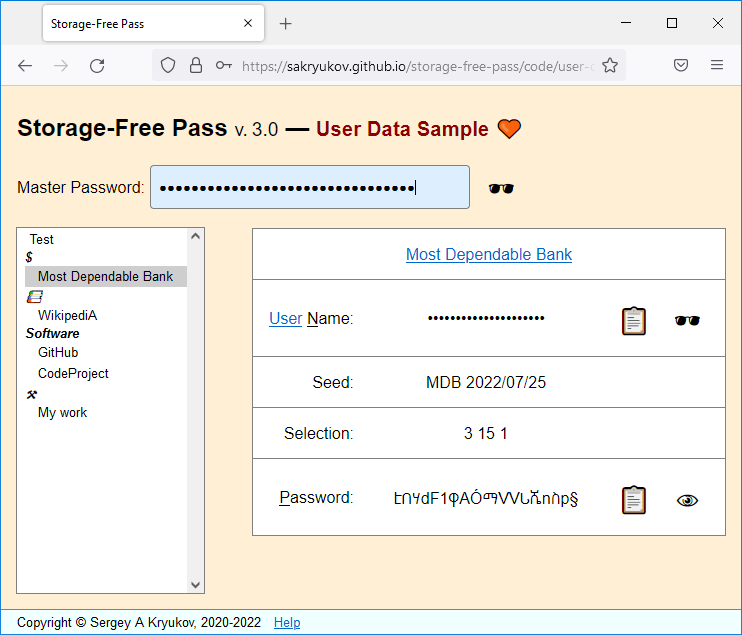
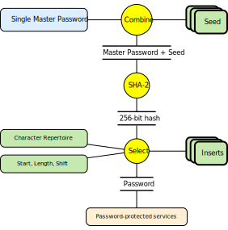

@numbering {
    enable: false
}

{title}No need to Store, Encrypt or Memorize Passwords! (???)

<!--
Original publication:
https://www.codeproject.com/Articles/5297157/Markdown-Calculator
-->

[*Sergey A Kryukov*](https://www.SAKryukov.org){.author}

Generator of highly secure passwords based on cryptographic hash and master password, which should be memorized; no password storage is involved

Storage-Free Pass is the application used to provide passwords for multiple services based on a single master password. Unlike other systems providing encrypted storage for passwords, this system does not require password storage at all. Instead, the deterministic passwords are securely generated every time they are needed. It is cryptographically infeasible to restore the passwords without knowing the master password. This is the only thing a user needs to remember. How is it possible? The present article explains that.

<!-- copy to CodeProject from here ------------------------------------------->

<ul class="download"><li><a href="5291705/Working/JavaScript-Playground.zip">Download source code — 271 KB</a></li></ul>

 {id=image-top}

<blockquote id="epigraph" class="FQ">
Epigraphs:

 
A barn owl brought Neville a small package from his grandmother. He opened it excitedly and showed them a glass ball the size of a large marble, which seemed to be full of white smoke. 
“It’s a Remembrall!” he explained. “Gran knows I forget things — this tells you if there’s something you’ve forgotten to do. Look, you hold it tight like this and if it turns red — oh…” His face fell, because the Remembrall had suddenly glowed scarlet, “…you’ve forgotten something….”
 Neville was trying to remember what he’d forgotten when Draco Malfoy, who was passing the Gryffindor table, snatched the Remembrall out of his hand.

<dd>J. K. Rowling, <i>Harry Potter and the Philosopher's Stone</i></dd>
</blockquote>

<blockquote id="epigraph" class="FQ">

 
Neville Longbottom: 
— The only problem is, I can’t remember what I’ve forgotten.

<dd>Steve Kloves, <i>Harry Potter and the Philosopher's Stone</i>, screenplay version based on the novel after J. K. Rowling</dd>
</blockquote>

## Contents{no-toc}

@toc

## Motivation

Let's give a better Remembrall to Neville Longbottom and all other people using password-protected Web services.

## Insights

Here is the idea: remember the old adventure movies where two characters have to get together and use two different keys at the same time to open a particularly important safe?

Let's do this: combine two strings, a master password and another one, called *seed*. The seed does not have to be secret. Now, look at the data flow diagram below. For now, only the top part is important.

Let's calculate the [cryptographic hash](https://en.wikipedia.org/wiki/Cryptographic_hash_function) out of the combination master password + seed.

In our case, the hash function returns 256 bits of data, and we can use this data to generate a password based on some *character repertoire*, the set of the characters acceptable for a password. Depending on the password size, the amount of information, contained in the hash value, can be redundant or insufficient relative to the maximum password size, but it is not important. What is important is that we can create a maximally strong password for the given limitations imposed on the password by the password-protected service. What is more important, it is cryptographically infeasible to reconstruct a master password, even if one of the service passwords is stolen. 

{id=data-flow}

We will discuss further detail in the [Implementation](#heading-implementation) section.

## Usage

### Basic Setup

Basic Usage:

~~~{lang=html}{id=usage-basic}
&lt;head&gt;
  &lt;script&gt; src="../storage-free-pass.api/API.js"&lt;/script&gt;
&lt;/head&gt;
~~~

### Working with Accounts, User Names, and Passwords

Let's consider the usage in more detail and see how all the related problems are addressed.

### How the Services Break your Safety and How to Work Around

### Test Account: Beware of the One Behind You

### Password Renewal

### Using or not Using Public Web Storage?

There is nothing wrong with it. Your Web page with your instance of Storage-free Pass can be itself password-protected (but then you would need to remember one more password), and it would be relatively weak protection. So what? If someone steals your files, this person would only get information on your account and user names. However, if you think this is too sensitive information, don't do it, but you would not need to worry about your passwords. Neither your master password nor your account passwords can be obtained anyway.

## Implementation

See [Data flow](#data-flow)

???

### Cryptosystem

[GitHub](https://github.com/SAKryukov/storage-free-pass)

~~~{lang=Javascript}{id=javascript-cryptosystem}
"use strict";

const passwordGenerator = (() => {

    const hashBits = 256;
    const cryptographicHashAlgorithmPrefix = "SHA-";

    async function digestSHA2(message) {
        // encode as (utf-8) Uint8Array
        const msgUint8 = new TextEncoder().encode(message);
        const hashBuffer =
            // hash the message:
            await crypto.subtle.digest(
                `${cryptographicHashAlgorithmPrefix}${hashBits}`, msgUint8);
        // convert buffer to byte array:
        return Array.from(new Uint8Array(hashBuffer));
    } //digestSHA2

    async function generatePassword(
            masterPassword, seed,
            start, length, characterRepertoire,
            shift, inserts)
    {
        if (!masterPassword) return String.empty;
        const arrayOfBytes = await digestSHA2(masterPassword + seed);
        const maxLength = arrayOfBytes.length;
        if (!start) start = 0;
        start = start % maxLength;
        if (!length) length = maxLength;
        if (length > maxLength) length = maxLength;
        if (!shift) shift = 0;
        shift = shift % characterRepertoire.length;
        let output = String.empty;
        for (let index = start; index < start + length; ++index)
            output += characterRepertoire.charAt(
              (shift + arrayOfBytes[index % maxLength])
              % characterRepertoire.length);
        if (!inserts) return output;
        if (!(inserts instanceof Array)) inserts = [inserts];
        for (let insert of inserts)
            output = insert.position ?
                output.slice(0, insert.position) + insert.value
                    + output.slice(insert.position)
                :
                insert.value + output;
        return output;
    }; //generatePassword

    return generatePassword;
    
})();
~~~

???

### Error Handling

## Advanced Usage

In fact, the [Live Demo](https://sakryukov.github.io/storage-free-pass/code/user-demo) code samples already show the advanced syntax of the use of the product. Even though it doesn't enable any advanced features, it can be used as a template for the advanced syntax.

### Custom Cryptosystem

~~~
&lt;head&gt;
  &lt;script&gt;script
    data-crypto="../storage-free-pass.api/crypto.js"
    src="../storage-free-pass.api/API.js"&lt;/script&gt;
&lt;/head&gt;
~~~

Naturally, it should be not the file "../storage-free-pass.api/crypto.js" provided, but some other file. The content of the file should provide the same interface: it should return some function, a password generator, and that function should return an asynchronous function with 7 arguments, returning a password, like the one shown in the default [cryptosystem code](#javascript-cryptosystem).

I would also strongly recommend that the data flow at least once passes through a standard implementation of a cryptographic hash function. You can combine different hash functions, and use different algorithms of the character selection for a resulting password, but only a strong cryptographic hash function can make the algorithm cryptographically strong.

Can a custom cryptosystem be practically useful or not? I would say, yes and no.

Theoretically speaking, it can improve the strength of your protection, but how? Let's consider the fantastic situation where someone has virtually unlimited computing power and knows your account information. Also, that person would need one of your account passwords, because otherwise, it is impossible to check if some computed string is an actual password, and the Web services are usually protected against repeated attempts to authenticate. We also need to assume that this person does not have the access to your custom cryptosystem.

Then, let's assume that the malicious artist successfully finds a master password resulting in some known account password. But it is found with the default cryptosystem. With your cryptosystem, that reconstructed master password would not work for other accounts, so the entire work would be useless.

Is it better protection or not? First of all, the protection is improved for the unrealistic situation, because the recovery of a master password is cryptographically infeasible anyway. Also, this is a typical example of [security by obscurity](https://en.wikipedia.org/wiki/Security_through_obscurity). Conclusion? Use your own judgment.

### Importance of a Revision Control System

I would highly recommend the usage of some Revision Control System for the support of the account data, presumably distributed one, like git, Mercurial, or Bazaar.

It's a big common misconception that such a system is only for software developers.

???

## Live Demo

This is the [Live Demo](https://sakryukov.github.io/storage-free-pass/code/user-demo).

## What's Next?

The creation of the accounts structure is still manual programming. It can be done even without any programming experience, just by the available sample packages with the product.

However, it's not a big problem to create another tool to be used to program accounts graphically and generate the account code. It's not a problem to make this tool based on a Web browser. The user can open ???

## Conclusions

The inertia of thinking is a bad thing.
