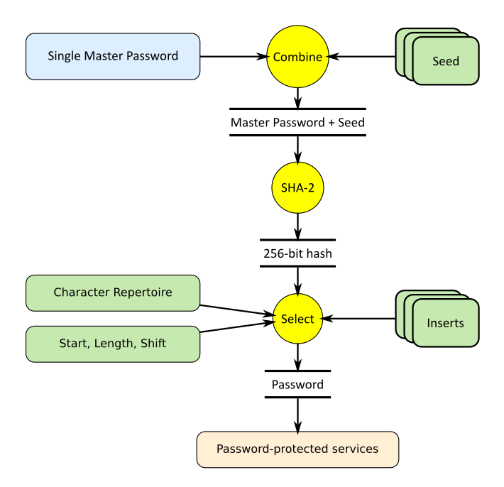

@numbering {
    enable: false
}

{title}No need to Store, Encrypt or Memorize Passwords!

<!--
Original publication:
https://www.codeproject.com/Articles/5297157/Markdown-Calculator
-->

[*Sergey A Kryukov*](https://www.SAKryukov.org){.author}

Generator of highly secure passwords based on cryptographic hash and master password, which should be memorized; no password storage is involved.

Storage-Free Pass is the application used to provide passwords for multiple services based on a single master password. Unlike other systems providing encrypted storage for passwords, this system does not require password storage at all. Instead, the deterministic passwords are securely generated every time they are needed. It is cryptographically infeasible to restore the passwords without knowing the master password. This is the only thing a user needs to remember. How is it possible? The present article explains that.

<!-- copy to CodeProject from here ------------------------------------------->

<ul class="download"><li><a href="5291705/Working/JavaScript-Playground.zip">Download source code — 271 KB</a></li></ul>

 {id=image-top}

<blockquote id="epigraph" class="FQ">
Epigraphs:

 
A barn owl brought Neville a small package from his grandmother. He opened it excitedly and showed them a glass ball the size of a large marble, which seemed to be full of white smoke. 
“It’s a Remembrall!” he explained. “Gran knows I forget things — this tells you if there’s something you’ve forgotten to do. Look, you hold it tight like this and if it turns red — oh…” His face fell, because the Remembrall had suddenly glowed scarlet, “…you’ve forgotten something….”
 Neville was trying to remember what he’d forgotten when Draco Malfoy, who was passing the Gryffindor table, snatched the Remembrall out of his hand.

<dd>J. K. Rowling, <i>Harry Potter and the Philosopher's Stone</i></dd>
</blockquote>

<blockquote id="epigraph" class="FQ">

 
Neville Longbottom: 
— The only problem is, I can’t remember what I’ve forgotten.

<dd>Steve Kloves, <i>Harry Potter and the Philosopher's Stone</i>, a screenplay version based on the novel after J. K. Rowling</dd>
</blockquote>

[GitHub](https://github.com/SAKryukov/storage-free-pass)

## Contents{no-toc}

@toc

## Motivation

Let's give a better Remembrall to Neville Longbottom and all other people using password-protected Web services.

One well-recognized password problem is that multiple password-protected services require people to create multiple passwords and encourage them not to re-usе the passwords and use strong passwords. It is reasonable but multiple passwords are near-impossible to remember for most people, and it forces people to record the passwords, which is a big compromise to security.

One obvious solution is *using password managers*, but there are different factors repelling people from using them.

Storage-Free Pass solves many problems related to password managers. Let's discuss them.

### What's Wrong with Password Managers?

The first look at the [list of password managers on Wikipedia](https://en.wikipedia.org/wiki/List_of_password_managers) shows that half of them are proprietary. What, not only do they offer me to store my passwords but also to use some close-source code doing... who knows what? No, thank you, I'm not just that insane.

Also, those with source code are typically too complicated to make sure that they don't do anything except what I want.

The set of passwords is a too important personal asset to risk.

Another problem is that most password managers are not cross-platform. Basically, I need to use only my own computer where the tool is installed.

If a product is open-source, it can be difficult for many people to build it. Also, it's not so easy to assert the safety of the code.

The product I offer is free of all those problems. It can be kept on nearly any device without risk, even if the device is lost and stolen. It can also be kept on some Web site, even a public site. It has a clearly observable core placed in one file, and the rest of the code is quite easy to inspect and assess its safety.

## Insights

Here is the idea: remember the old adventure movies where two characters have to get together and use two different keys at the same time to open a particularly important safe?

Let's do this: combine two strings, a master password and another one, called *seed*. The seed does not have to be secret. Now, look at the data flow diagram below. For now, only the top part is important.

Let's calculate the [cryptographic hash](https://en.wikipedia.org/wiki/Cryptographic_hash_function) out of the combination master password + seed.

In our case, the hash function returns 256 bits of data, and we can use this data to generate a password based on some *character repertoire*, the set of characters acceptable for a password. Depending on the password size, the amount of information, contained in the hash value, can be redundant or insufficient relative to the maximum password size, but it is not important. What is important is that we can create a maximally strong password for the given limitations imposed on the password by the password-protected service. What is more important, it is cryptographically infeasible to reconstruct a master password, even if one of the service passwords is stolen. 

{id=data-flow}

We will discuss further detail in the [Implementation](#heading-implementation) section.

## Usage

### Basic Setup

Basic Usage:

~~~{lang=html}{id=usage-basic}
&lt;head&gt;
  &lt;script&gt; src="../storage-free-pass.api/API.js"&lt;/script&gt;
&lt;/head&gt;
~~~

In the `&lt;body&gt;` element, add a single script. It should define the function const `userData = () => {/*...*/};` and return the structure of the user accounts.

Please see "storage-free-pass.api/help.html" for the description of the account information structure, "user-demo/index.html" for the JavaScript sample.

### Working with Accounts, User Names, and Passwords

Let's consider the usage in more detail and see how all the related problems are addressed.

### Password Renewal

The problem of password renewal is one of the problems people pointed out in their criticism of some password managers.

To make passwords easily renewable, I would recommend maintaining a reasonable form of the seed values. It could be a string, containing the name of the service, followed by the date of the password creation, initial setup, or renewal. By the way, in all cases, the best format for a date is not the one dictated by the current *culture*, but culture-independent YYYY/MM/DD form, as it gives the form causing the lexicographical ordering the same as the time ordering, least significant digits being at the end of the string. This is not the rule, just my recommendation. I don't think anyone needs the time of the day for better accuracy because it is not very likely that some password has to be renewed more than once a day, but it can also be used if it happens for one or another reason.

This way, the change of the date would be the only operation needed to renew the password. In most cases, the old password needs to be recorded, as it needs to be submitted during the password renewal process provided by the password-protected service.

Unfortunately, there are rare cases when it is not enough. A problem can appear because some of the password-protected services impact some weird "good password" rules which actually can compromise the quality of our passwords. All these problems are solvable, as Storage-Free Pass suggests a workaround for all of them. Let's consider those problems.

### How the Services Try to Break your Safety and How to Work Around

The password-protected services try to promote "strong" passwords by adding some limitations. Naturally, no limitations can improve password strength. At the same time, I understand, that the authors of these schemas consider the limitation as a fool-proof feature used to fight potentially foolish passwords created by clients.

I don't really think it helps much, but it prevents the acceptance of algorithmically generated and obviously the strongest passwords.

Some of those limitations are extremely stupid and create some hassles. In all cases, Storage-Free Pass suggests the means to work around all the limitations. Let's consider them.

- ***Character repertoire***. I would not limit a character repertoire in any way. In fact, I do use at least one service, accepting a very wide character repertoire. One can easily mix any, say, punctuation, Latin, Armenian, Georgian, Hebrew, Devanāgarī, Cyrillic, Persian characters, mathematical symbols, and a lot more, in one password. Why not? If a client created such a password, this person can reasonably expect that they can enter it again in all cases. If this is not the case.
  
Unfortunately, this is a rare case. A service can impose the stupidest limitations on the character repertoire. That's why a creator of the Storage-Free Pass account information can store several separate character repertoire strings to be applied to different services. Please see "storage-free-pass.api/help.html" for the description of the account information structure, "user-demo/index.html" for the JavaScript examples.

- ***Patterns***. Some password rules require that the password should not contain some "patterns", such as a sequence of consecutive or repeated characters. Why?! What's wrong with patterns? Why "123" or "111" is a "pattern" but, say, "qwerty" is not? No answer — some "security specialists" are just morons, nothing else.
  Do I even have to explain that such a limitation only makes passwords less strong? Well, isn't it obvious, that with a fully random password generation process, apparently giving the strongest passwords, the probability of short patterns of this sort is high enough? The presence of some random patterns cannot make password-guessing techniques more efficient. Anyway, the server-side techniques for fighting password guessing are different and well-known.
  Unfortunately, it is not possible to prevent all different "patterns" automatically in all cases. The workaround can better be found by some trial and error. I add an arbitrary suffix to the seed string. This suffix can be the time of the day, or anything else. Chances are, the next renewal of the password for some other day will eliminate the need for it.

- "***Special characters***". No one defined "special characters", there is no such thing. However, many password requirements include such an item as "should contain at least one low-case character, upper-case character, digit, and a special character". Sometimes they define what they mean by a special character, sometimes not, then it can be determined experimentally.
  
To work around this problem, Storage-Free Pass suggests "inserts" with an arbitrary point of insertion. One can add a permanent substring with all required characters, or more than one such substring. Note that the length of inserts is not counted as a part of the password length, so their length is added to the length of a final password.

- **Password length**. I would not like a limited password length. Why? The services use relational databases, and should not store any passwords anyway, and cryptographically reasonable systems really store the cryptographic hash values of the passwords, hence the sizes of stored data are fixed. Nevertheless, the password length is usually limited, sometimes by some frustratingly low numbers of characters. It looks like they care about the ability of a client to remember the password, but this assumption is not realistic anyway.
 There is nothing you can do about it, but if passwords are limited to a short length, such as 8, this is one of the good reasons not to trust the service. If the service is a financial institution, it can make a good reason to deny its services and find something else, not because of password length, but because of the general concerns of the level of security in such an organization.

Please see "storage-free-pass.api/help.html" for the description of the account information structure, "user-demo/index.html" for the JavaScript sample.

### Test Account: Beware of the One Behind You

It is quite possible to keep your passwords secret, even if someone can watch what happens on your monitor.

I personally never face this problem, but this is what I do: my first account is the *test account* I use exclusively for one purpose: validation of the correctness of my master password.

The master password, account username, and resulting account password, as they are visualized in the table representing a selected account, have two modes: hidden and visualize, toggled by three buttons showing either a human eye (visible) or sunglasses (hidden).

I enter the master password when my test account is selected, and visualize its resulting account password. The seed string for the test account is chosen in a way that the resulting password is easy to recognize. I don't need to learn the resulting password by heart, as I never need to enter it. It's enough to have a feeling that it is something familiar. Any mistake in the master password would make this string very different.

When  I'm sure the master password is correct, I click the button to make my account passwords hidden and perform all the authentication operations I need. Even if someone is spying on my monitor, there is no chance to eavesdrop on my communications to figure out any critical information.

### Using or not Using Public Web Storage?

There is nothing wrong with it. Your Web page with your instance of Storage-free Pass can be itself password-protected (but then you would need to remember one more password), and it would be relatively weak protection. So what? If someone steals your files, this person would only get information on your account and user names. However, if you think this is too sensitive information, don't do it, but you would not need to worry about your passwords. Neither your master password nor your account passwords can be obtained anyway.

## Implementation

See [Data flow](#data-flow)

It's enough to show one key file where the cryptosystem is defined. It [can be custom](#heading-custom-cryptosystem). It implements the [data flow](#id=data-flow) based on the arguments of the function `generatePassword`. It can be any other function with the same profile returned by `passwordGenerator`.

In this implementation, the combination of `password` and `seed` is a simple concatenation. It is used to get a cryptographic cache value represented by the array `arrayOfBytes`. The values of the arrays are used to get the password out of the `characterRepertoire`. The index the characters in `characterRepertoire` in a cyclic manner, and the cycle depends on the password `length`, `start` and `shift` arguments.

On top of that, some array of fixed strings can be inserted in the resulting password. This array is optional and is passed as `inserts` argument. It is done to satisfy some password requirements imposed by some password-protected services. Note that it makes the password length greater than the argument `length`. In other words, `lengths` specifies not the final password length, but its length before the insertion. The reason for this feature was explained [above](#heading-how-the-services-try-to-break-your-safety-and-how-to-work-around).

### Cryptosystem

All the cryptography is based on the standard API coming with the JavaScript engine, `crypto.subtle`, implementing [the Web Crypto API's low-level cryptography features](https://developer.mozilla.org/en-US/docs/Web/API/Crypto/subtle).

~~~{lang=Javascript}{id=javascript-cryptosystem}
"use strict";

const passwordGenerator = (() => {

    const hashBits = 256;
    const cryptographicHashAlgorithmPrefix = "SHA-";

    async function digestSHA2(message) {
        // encode as (utf-8) Uint8Array
        const msgUint8 = new TextEncoder().encode(message);
        const hashBuffer =
            // hash the message:
            await crypto.subtle.digest(
                `${cryptographicHashAlgorithmPrefix}${hashBits}`, msgUint8);
        // convert buffer to byte array:
        return Array.from(new Uint8Array(hashBuffer));
    } //digestSHA2

    async function generatePassword(
            masterPassword, seed,
            start, length, characterRepertoire,
            shift, inserts)
    {
        if (!masterPassword) return String.empty;
        const arrayOfBytes = await digestSHA2(masterPassword + seed);
        const maxLength = arrayOfBytes.length;
        if (!start) start = 0;
        start = start % maxLength;
        if (!length) length = maxLength;
        if (length > maxLength) length = maxLength;
        if (!shift) shift = 0;
        shift = shift % characterRepertoire.length;
        let output = String.empty;
        for (let index = start; index < start + length; ++index)
            output += characterRepertoire.charAt(
              (shift + arrayOfBytes[index % maxLength])
              % characterRepertoire.length);
        if (!inserts) return output;
        if (!(inserts instanceof Array)) inserts = [inserts];
        for (let insert of inserts)
            output = insert.position ?
                output.slice(0, insert.position) + insert.value
                    + output.slice(insert.position)
                :
                insert.value + output;
        return output;
    }; //generatePassword

    return generatePassword;
    
})();
~~~

Note that the function `generatePassword` is asynchronous. So, the actual result of the password generation is exposed through the resolution of the *promise* returned by this function. For this purpose, in the main application file "storage-free-pass.api/ui.js", this function is wrapped in another `generatePassword` function:

~~~{lang=Javascript}{id=javascript-use-generate-password}
    const generatePassword = () => {
        for (let accountIndex in inputData.accounts)
            generatedData[accountIndex] = undefined;
        const index = accountIndexMap[elements.accountSelector.selectedIndex];
        passwordGenerator(
            elements.masterPassword.value,
            inputData.accounts[index].identity.seed,
            inputData.accounts[index].identity.selection.start,
            inputData.accounts[index].identity.selection.length,
            inputData.accounts[index].identity.selection.characterRepertoire,
            inputData.accounts[index].identity.selection.shift,
            inputData.accounts[index].identity.selection.inserts)
                .then(autoGeneratedPassword => {
                    generatedData[index] = autoGeneratedPassword;
                    showPassword();
                });
    }; //generatePassword
~~~

Everything else in the code is pretty much trivial.

## Advanced Usage

In fact, the [Live Demo](https://sakryukov.github.io/storage-free-pass/code/user-demo) code samples already show the advanced syntax of the use of the product. Even though it doesn't enable any advanced features, it can be used as a template for advanced syntax.

### Custom Cryptosystem

~~~
&lt;head&gt;
  &lt;script
    data-crypto="../storage-free-pass.api/crypto.js"
    src="../storage-free-pass.api/API.js"&gt;&lt;/script&gt;
&lt;/head&gt;
~~~

Naturally, it should be not the file "../storage-free-pass.api/crypto.js" provided, but some other file. The content of the file should provide the same interface: it should return some function, a password generator, and that function should return an asynchronous function with 7 arguments, returning a password, like the one shown in the default [cryptosystem code](#javascript-cryptosystem).

I would also strongly recommend that the data flow at least once passes through a standard implementation of a cryptographic hash function. You can combine different hash functions, and use different algorithms of the character selection for a resulting password, but only a strong cryptographic hash function can make the algorithm cryptographically strong.

Can a custom cryptosystem be practically useful or not? I would say, yes and no.

Theoretically speaking, it can improve the strength of your protection, but how? Let's consider the fantastic situation where someone has virtually unlimited computing power and knows your account information. Also, that person would need one of your account passwords, because otherwise, it is impossible to check if some computed string is an actual password, and the Web services are usually protected against repeated attempts to authenticate. We also need to assume that this person does not have the access to your custom cryptosystem.

Then, let's assume that the malicious artist successfully finds a master password resulting in some known account password. But it is found with the default cryptosystem. With your cryptosystem, that reconstructed master password would not work for other accounts, so the entire work would be useless.

Is it better protection or not? First of all, the protection is improved for the unrealistic situation, because the recovery of a master password is cryptographically infeasible anyway. Also, this is a typical example of [security by obscurity](https://en.wikipedia.org/wiki/Security_through_obscurity). Conclusion? Use your own judgment.

## Live Demo

This is the [Live Demo](https://sakryukov.github.io/storage-free-pass/code/user-demo).

## Testing

The application Storage-Free Pass has been practiced extensively for more than three last years on real financial institutions, shopping systems, communication, vendor, and other services. In particular, this practice included frequent password renewals.

## What's Next?

- The creation of the accounts structure is still manual programming. It can be done even without any programming experience, just by the available sample packages with the product.
However, it's not a big problem to create another tool to be used to program accounts graphically and generate the account code. It's not a problem to make this tool based on a Web browser. The user can open an HTML file with the `script` element, containing account information, add or edit accounts graphically and save a new HTML file. Among other things, it will simplify password renewal.

- Maybe I'll add the possibility to use encrypted passwords. I [criticized them](#heading-what27s-wrong-with-password-managers3f), but there are situations where they are useful. One such situation is the logon to a device when the clipboard is not accessible. In this situation, the user can get a reminder of a password stored on another device. It can be a separate application of a mode in the existing application.

## Conclusions

The inertia of thinking is a bad thing.

The idea to use stored passwords seems natural, but in fact, it stems from the practice of remembering mentally generated passwords. The same goes for the idea that a password should be easily readable and easy to type. No, it doesn't have to be.

The alternative suggested in this article and implemented in Storage-Free Pass is quite working and safe. A password can be generated on the fly at the moment it is needed.

Only in rare cases do we need to create a password mentally and remember or store it.

## Credits

The present work is inspired by [this work](https://ss64.com/pass) by Simon Sheppard.