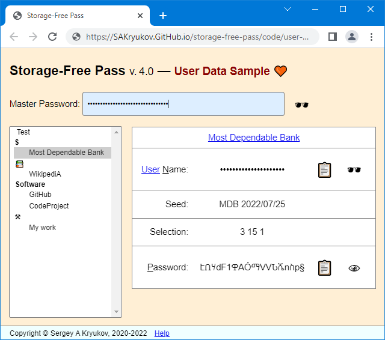

@numbering {
    enable: false
}

{title}No need to Store, Encrypt or Memorize Passwords! (???)

<!--
Original publication:
https://www.codeproject.com/Articles/5297157/Markdown-Calculator
-->

[*Sergey A Kryukov*](https://www.SAKryukov.org){.author}

Generator of highly secure passwords based on cryptographic hash and master password, which should be memorized; no password storage is involved

*This password generator is deterministic. It doesn't store any passwords in any form. Instead, passwords are re-generated every time. First, SHA-2 cryptographic hash is generated out of two strings: 1) master password, one for all accounts, memorized by the use and entered each time, and 2) seed, created per account, stored in the user's data. Then part of the hash is used for the generation of passwords; it uses the following parameters stored in the user's data, per account: starting position in the hash, length of a password, character repertoire, and shift in the character repertoire. It makes password recovery of the account passwords and the master password infeasible, even if access to the user-stored data is obtained.*

<!-- copy to CodeProject from here ------------------------------------------->

<ul class="download"><li><a href="5291705/Working/JavaScript-Playground.zip">Download source code — 271 KB</a></li></ul>

 {id=image-top}

<blockquote id="epigraph" class="FQ">
Epigraphs:

 
A barn owl brought Neville a small package from his grandmother. He opened it excitedly and showed them a glass ball the size of a large marble, which seemed to be full of white smoke. 
“It’s a Remembrall!” he explained. “Gran knows I forget things — this tells you if there’s something you’ve forgotten to do. Look, you hold it tight like this and if it turns red — oh…” His face fell, because the Remembrall had suddenly glowed scarlet, “…you’ve forgotten something….”
 Neville was trying to remember what he’d forgotten when Draco Malfoy, who was passing the Gryffindor table, snatched the Remembrall out of his hand.

<dd>J. K. Rowling, <i>Harry Potter and the Philosopher's Stone</i></dd>
</blockquote>

<blockquote id="epigraph" class="FQ">

 
Neville Longbottom: 
— The only problem is, I can’t remember what I’ve forgotten.

<dd>Steve Kloves, <i>Harry Potter and the Philosopher's Stone</i>, screenplay version based on the novel after J. K. Rowling</dd>
</blockquote>

## Content{no-toc}

@toc

## Motivation

Let's give a better Remembrall to Neville Longbottom and all other people using password-protected Web services.

## Insights

## Basic Usage

Basic Usage:

~~~{lang=html}{id=usage-basic}
&lt;head&gt;
  &lt;script&gt; src="../storage-free-pass.api/API.js"&lt;/script&gt;
&lt;/head&gt;
~~~

## Live Demo

This is the [Live Demo](https://sakryukov.github.io/storage-free-pass/code/user-demo).

## Implementation

[GitHub](https://github.com/SAKryukov/storage-free-pass)

~~~{lang=Javascript}{id=javascript-sample}
const eggs = 3.49, sourCream = 2.49, milk = 4.99
~~~

???

## Use Cases

Let's consider the usage in more detail and see how all the related problems are addressed.

### How the Services Break your Safety and How to Work Around

### Test Account: Beware of the One Behind You

### Password Renewal

## Advanced Usage

In fact, the [Live Demo](https://sakryukov.github.io/storage-free-pass/code/user-demo) code samples already shows advanced syntax of the use of the product. Even though it doesn't enable any advanced features, it can be used as a template for the advanced syntax.

### Custom Cryptosystem

~~~
&lt;head&gt;
  &lt;script&gt;script
    data-crypto="../storage-free-pass.api/crypto.js"
    src="../storage-free-pass.api/API.js"&lt;/script&gt;
&lt;/head&gt;
~~~

### Importance of a Revision Control System

I would highly recommend the usage of some Revision Control System for the support of the account data, presumably distributed one, like git, Mercurial, or Bazaar.

It's a big common misconception that such a system is only for software developers.

???

## What's Next?

The creation of the accounts structure is still manual programming. It can be done even without any programming experience, just by the available sample packages with the product.

However, it's not a big problem to create another tool to be used to program accounts graphically and generate the account code. It's not a problem to make this tool based on a Web browser. The user can open 

## Conclusions

The inertia of thinking is a bad thing.
